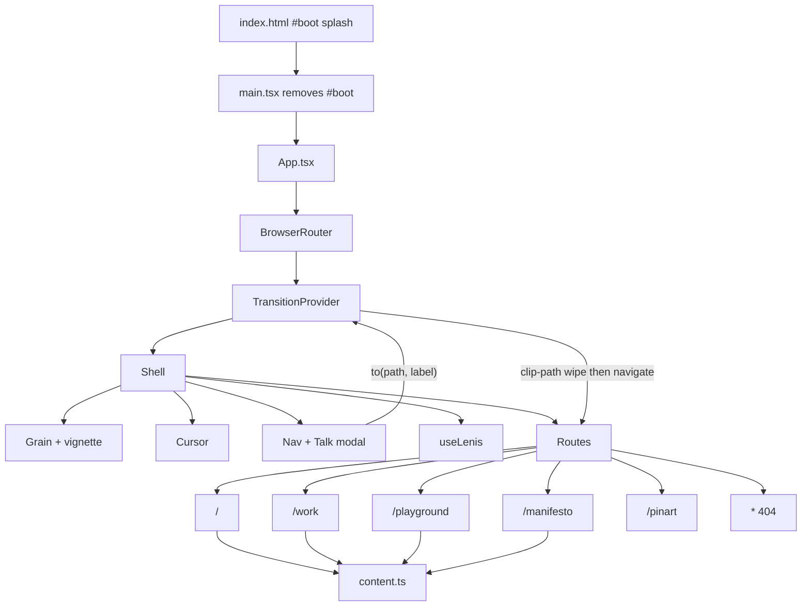

# Architecture

How this site was prepared, what it is made of, and how the pieces fit.

This document describes the **shipped** tree under `src/`. It is not a wishlist.

---

## 1. Intent

Build a personal site for **Yash Mishra**, 3rd-year CSE at SIES GST, Mumbai, positioned as an **Applied AI Engineer**.

The site had to do three things:

1. Look like a designed object, not a template.
2. Put real work (Legal Metrology, BeaconOps) next to in-build samples without lying about which is which.
3. Stay a **static front-end** so it can deploy free on Vercel or Netlify.

There is no API, no CMS, no auth. All copy lives in `src/data/content.ts`. All pictures live in `public/images/`.

---

## 2. How it was prepared

### 2.1 Brief and lock

The brief was collected first, then frozen:

- Title: Applied AI Engineer.
- Quote: *If you’re nothing without AI, you shouldn’t have it.*
- Location: Mumbai, Maharashtra only.
- Contact: email, phone, LinkedIn, Instagram, GitHub (`mav1730`).
- Work: Legal Metrology = real. CodeBench and AgentJudge = fake / in build.
- Photos from the local `ym pics` folder. Faces were not invented from text.

Visual ideas taken from five references (steal the mechanic, not the brand):

| Reference | What we kept |
| --- | --- |
| Synapser | Full-viewport clip-path wipe, percent counter |
| Bill Chien | Giant first / last name split around a photo + orb |
| stillmakingstuff | Hover list + floating image; Talk as a window, not a form |
| Juan Mora | 3D self as a *closing* beat (later dropped for the cream theme) |
| vshslv.com | PINART: mouse-drop image trail + ASCII portrait field |

The theme pivoted to an Echoes-style cream / ink / red poster system (Playfair, Newsreader, Oswald) after a darker 3D-hero pass felt off.

### 2.2 Build order

1. Vite + React + TypeScript scaffold.
2. Design tokens and type in `index.css`.
3. Content lock in `content.ts`.
4. Shell: grain, custom cursor, nav, wipe.
5. Home (hero → intro → work → quote → license → footer).
6. Work, Playground, Manifesto.
7. Talk modal (Nokia still + real details).
8. PINART page (ASCII background + hover-only trail).
9. Production pass: unused code out, SPA rewrites, lint, `tsc -b`, preview smoke, GitHub.

### 2.3 What was deliberately left out

- No backend and no env files with secrets.
- Phone and email are on the **Talk** surface, not in the README.
- Abandoned experiments (footer 3D bust, living-portrait frame cycle, unused loaders) were deleted before the first public push.
- Local screenshot scripts and `shots/` are gitignored.

---

## 3. Stack

```
Browser
  └── Vite SPA (index.html + hashed JS/CSS)
        ├── React 19  (UI)
        ├── React Router 7  (client routes)
        ├── GSAP 3 + ScrollTrigger  (tweens, pin-less scrub)
        ├── Lenis  (smooth wheel; paused during Talk / wipe)
        └── CSS custom properties  (theme, no CSS-in-JS)
```

| Package | Role |
| --- | --- |
| `react` / `react-dom` | Component tree |
| `react-router-dom` | `BrowserRouter`, `Routes`, `useLocation`, `useNavigate` |
| `gsap` | Wipe timeline, hero, intro parallax, page reveals |
| `@gsap/react` | Present for GSAP React helpers (timelines are mostly vanilla GSAP) |
| `lenis` | Inertial scroll; `getLenis()` is shared so Talk can `stop()` / `start()` |
| `vite` + `@vitejs/plugin-react` | Dev server, HMR, production bundle |
| `typescript` | `tsc -b` before every production build |
| `oxlint` | Fast lint (`npm run lint`) |

**Not used:** Next.js, Tailwind, Redux, a CMS, Three.js, a backend.

Fonts load from Google Fonts in `index.html` (preconnect + one stylesheet).

---

## 4. Runtime shape



### Boot

1. `index.html` paints a black `#boot` layer so the first frame is not a white flash.
2. `main.tsx` removes `#boot` as soon as the module runs, then mounts React.
3. `TransitionProvider` plays the same wipe as a page change (`fromBoot: true`) unless the URL has `?ready=1`.
4. `booted` flips true. Pages that wait on `booted` then run their entrance tweens.

### Navigation

Clicks in `Nav` call `to(path, label)` instead of a raw `<Link>`:

1. Ignore if a wipe is already running or boot is not done.
2. If the path is already current, Lenis scrolls to top. No wipe.
3. Otherwise the curtain covers from the bottom (`BOTTOM` → `FULL` polygon), the counter runs 00–100, `navigate(path)` fires at cover, then the curtain exits through the top (`FULL` → `TOP`).
4. `body.wiping` locks overflow while that happens.

This is the Synapser mechanic: a clip-path curtain, not a fade.

---

## 5. Directory map

```
yash-mishra/
├── index.html                 HTML shell, meta, fonts, #boot
├── vite.config.ts             React plugin, appType: 'spa'
├── vercel.json                SPA rewrite for Vercel
├── public/
│   ├── _redirects             SPA rewrite for Netlify
│   ├── favicon.svg
│   └── images/                all stills (no remote CDN)
├── src/
│   ├── main.tsx
│   ├── App.tsx
│   ├── index.css              tokens + every layout rule
│   ├── data/content.ts        single content module
│   ├── context/Transition.tsx wipe + boot + to()
│   ├── lib/useLenis.ts        Lenis + getLenis()
│   ├── lib/usePageReveal.ts   inner-page entrance
│   ├── pages/
│   └── components/
├── ARCHITECTURE.md            this file
└── README.md                  run / deploy
```

### Pages

| File | Responsibility |
| --- | --- |
| `Home.tsx` | Long scroller. GSAP + ScrollTrigger local to a root ref. |
| `Work.tsx` | Case articles. Fake projects do not pretend to have a repo. |
| `Playground.tsx` | Four plates. External hrefs open in a new tab. |
| `Manifesto.tsx` | Two-column stuff list. Hover lerps a follow image. |
| `Pinart.tsx` | Fixed ASCII background + `StuffTrail`. |
| `NotFound.tsx` | Soft 404 with a wipe back home. |

### Components

| File | Responsibility |
| --- | --- |
| `Nav.tsx` | Fixed header. Transparent (`nav-clear`) on `/pinart`. Talk opens the modal. Mobile drawer is `inert` when closed. |
| `ContactModal.tsx` | Nokia still + details. Escape / backdrop close. Stops Lenis while open. |
| `LicenseCard.tsx` | 3D tilt card on Home. |
| `SiteFoot.tsx` | Slim foot on inner pages; large name/orb foot on Home (`big`). |
| `StuffTrail.tsx` | vshslv-style image drop on mousemove. No seed images. |
| `Cursor.tsx` | Crimson/ink cursor, z-index 500 (above Talk). Off on coarse pointers. |
| `Grain.tsx` | Looping noise canvas + vignette. |

---

## 6. Data

`src/data/content.ts` is the only content store.

```
profile     name, title, city, college, contact, quote
nav         route table for the header
projects    Legal Metrology + two in-build samples (fake: true)
stuff       ten manifesto lines + image paths (m1–m10)
playground  BeaconOps + three studies
aiQuotes    unused leftover list (safe to delete later)
```

Rules:

- Mark sample work with `fake: true` so the UI says “In build” / “Public repo when it ships”.
- Image paths are site-root (`/images/...`), never absolute disk paths.
- If a fact changes (phone, handle, year), change it here once.

---

## 7. Motion and scroll

### GSAP

Home registers `ScrollTrigger` and scopes every tween with `gsap.context(..., root)` so leaving the page reverts transforms.

Entrance tweens use **`fromTo` + `immediateRender: false`**, not `from()`. `from()` was leaving sections invisible after remounts (React Strict Mode, fast route changes).

Scrubbed effects (no pin):

- Hero photo vertical parallax; first / last name split apart.
- Intro portrait scale + `yPercent` while the section crosses the viewport.
- Work-row images open from an inset clip.

Inner pages use `usePageReveal(booted)` for title / kicker / cards.

### Lenis

`useLenis` creates one Lenis on the shell and stores it in a module binding.

```
getLenis()            read the live instance
getLenis()?.stop()    Talk open
getLenis()?.start()   Talk close
getLenis()?.scrollTo  same-route “go home” and #section jumps
```

Cleanup **does not** `ScrollTrigger.getAll().kill()`. That used to wipe page animations when Lenis remounted.

`body.wiping` and `body.modal-open` also set `overflow: hidden`.

---

## 8. PINART

PINART is a separate route so Manifesto stays a type page.

### Background

`public/images/pinart-bg.jpg` is an ASCII / terminal portrait of Yash (vshslv field: glyphs on black, orange dust on the right). The page is full-bleed; the nav on this route is transparent (`nav-clear`) so the field reads to the top.

### Trail

`StuffTrail` copies the vshslv mouse mechanic:

1. A pool of existing stills (m-series, work stills, series-c) starts **opacity 0**. Nothing is pre-placed.
2. On `mousemove`, if the pointer moved more than 90px, the next still is placed at the cursor (cycling scale `[1, 0.64, 0.8, …]`).
3. SVG lines connect the newest card to the pointer.
4. Drops are skipped over the nav, during a wipe, while Talk is open, or in the top 72px.

The stage sits at `z-index: 85` so cards sit **above** grain (80) and **below** nav (120).

Touch devices (`hover: none`) do not run the trail.

---

## 9. Visual system

Defined on `:root` in `index.css`:

| Token | Value | Use |
| --- | --- | --- |
| `--bg` / `--cream` | `#efe8dc` | Page |
| `--ink` / `--paper` | `#111110` / `#141210` | Type |
| `--lamp` | `#c4171d` | Emphasis, cursor, orb |
| `--nav-h` | `72px` | Offset for `.page` padding |

Type scale is clamp-based. Breakpoint `860px` stacks grids, hides desktop nav links, shows the menu.

Custom cursor: `cursor: none` on fine pointers; the drawn cursor is `position: fixed; z-index: 500`.

---

## 10. Production

### Build

```
npm run build   →  tsc -b && vite build
```

Output is hashed assets in `dist/`. `public/` is copied through (images, `_redirects`, favicon).

### SPA fallback

Client routes (`/work`, `/pinart`, …) must not 404 on refresh:

- Vercel: `vercel.json` rewrite to `index.html`.
- Netlify: `public/_redirects`.
- Vite: `appType: 'spa'`.

### Checks that were run before the public push

- `oxlint` — no errors (one Fast Refresh warning on `useTransitionNav`).
- `tsc -b && vite build` — green.
- Preview smoke of `/`, `/work`, `/playground`, `/manifesto`, `/pinart`, `*`, Talk.
- Image 200s, no leftover `#boot`.
- Bug pass: GSAP `from` → `fromTo`, Lenis + Talk, trail vs nav, external `target="_blank"`, closed mobile menu `inert`.

### What is not in git

`node_modules/`, `dist/`, `scripts/`, `shots/`, `.env*`, editor junk. See `.gitignore`.

---

## 11. Constraints and known limits

- **No backend.** Contact is `mailto:` / `tel:` / outbound social links.
- **Talk** is not a full focus trap. Escape and backdrop click close it. Lenis is stopped while it is open.
- **Cursor** re-renders on mousemove (label position). Fine for this page weight.
- **PINART trail** is desktop-hover only.
- **Sample projects** must stay marked `fake: true` until a public repo exists.
- **Do not** re-introduce `gsap.from()` for opacity/y entrances.
- **Do not** call `ScrollTrigger.getAll().kill()` from Lenis cleanup.

---

## 12. How to change things safely

| You want to… | Edit |
| --- | --- |
| Change name, quote, phone, links | `src/data/content.ts` |
| Add a project | `projects` in `content.ts` + a still in `public/images/` |
| Add a manifesto line | `stuff` (keep hover `img`) |
| Restyle the theme | `:root` in `src/index.css` |
| Change wipe timing | `playCycle` in `context/Transition.tsx` |
| Change PINART pictures | `POOL` in `components/StuffTrail.tsx` |
| Change PINART background | replace `public/images/pinart-bg.jpg` |

After any of the above:

```bash
npm run lint
npm run build
```

Then commit and push `main` if the GitHub deploy should update.
